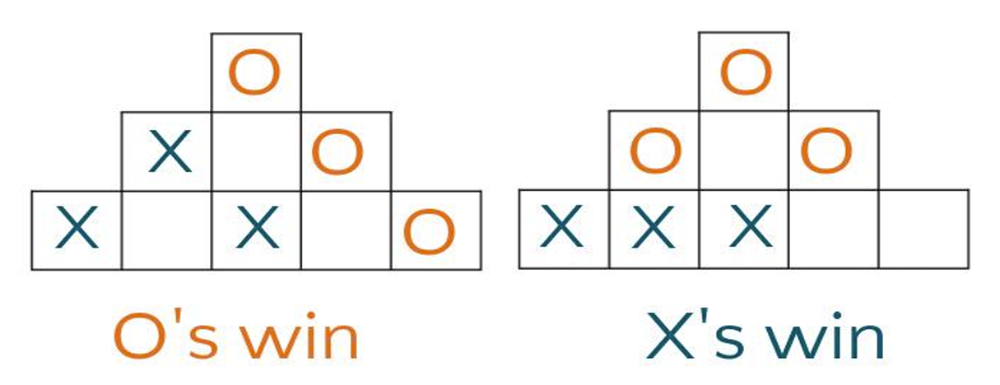
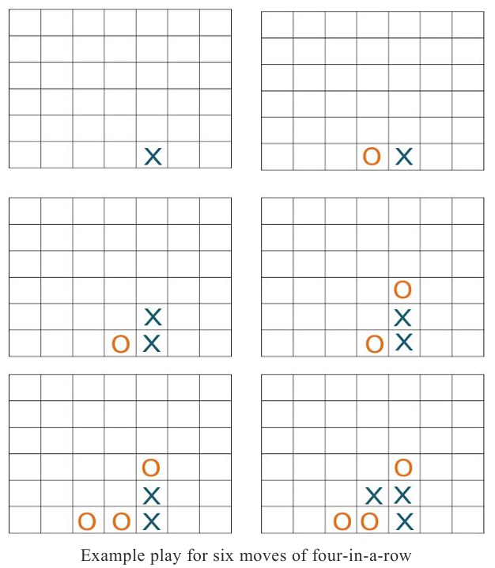
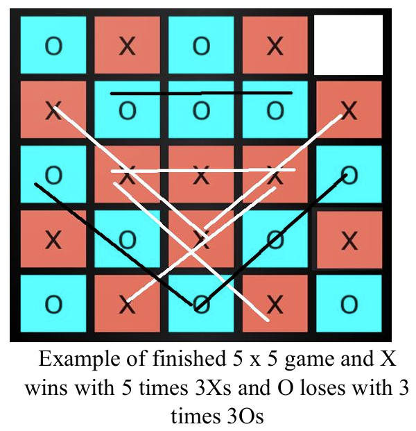
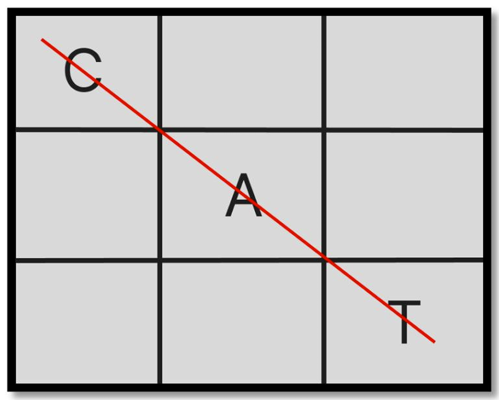
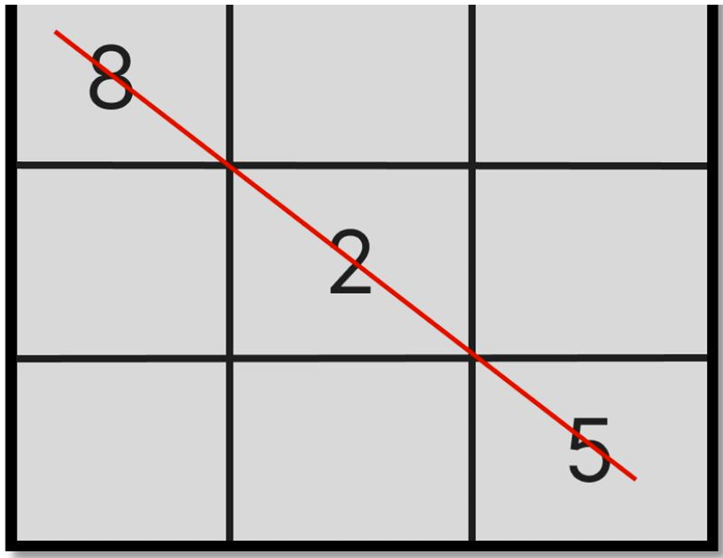
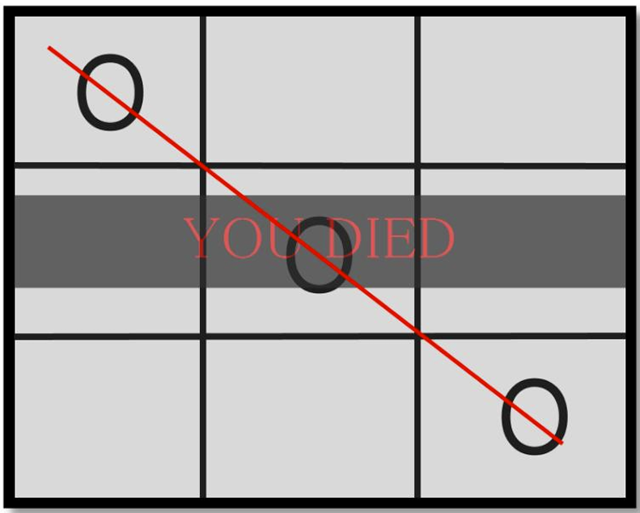

# Tic Tac Masterpiece 🎮
Welcome to the Tic-Tac-Masterpiece repository! This project features a collection of **8 creative and innovative games**, 
offering unique twists on classic board and puzzle games. Whether you're a fan of strategy, 
words, or math, this collection has something for everyone!

## 🌟 Overview:
This repository contains the implementation of 8 interactive games. Each game brings a fresh perspective to traditional gameplay, 
making it both engaging and challenging. The project is perfect for those who enjoy programming puzzles or experimenting with game design.

## 📋 Games Included:
- Pyramid Tic Tac Toe.
- Four In A Row.
- 5 x 5 Tic Tac Toe.
- Word Tic Tac Toe.
- Numerical Tic Tac Toe.
- Misere Tic Tac Toe.
- Ultimate Tic Tac Toe.
- SUS.

## 📖 Description Of Each Game:
### I. Pyramid Tic Tac Toe: 

📜 Description.

- Pyramid Tic-Tac-Toe is a three-dimensional version of the classic game. The game board is shaped like a pyramid, with five squares on the base, three in the middle, and one at the top. Players take turns marking Xs and Os on the squares, aiming to get three-in-a-row vertically, horizontally, or diagonally.

🏆 Winning.

The first player to get three-in-a-row vertically, horizontally, or diagonally wins.

### II. Four In A Row:

📜 Description.

- You will recognize four-in-a row as a two-dimensional version of the classic game, Connect Four. The game board consists of a 7 x 6 grid. Seven columns of six squares each. Instead of dropping counters as in Connect Four, players mark the grid with Xs and Os as in tic-tac-toe.

📋 Rules.

The first player places an X in the bottom square of any column. Taking turns, players make their mark in any column, as long as it is in the lowest square possible. See image below for an example of possible first six moves.

🏆 Winning.

The first player to get four-in-a-row vertically, horizontally, or diagonally wins.

### III. 5 x 5 Tic Tac Toe:

📜 Description.

- This tic-tac-toe variation is played on a 5 x 5 grid.

📋 Rules.

Players take turns placing an X or an O in one of the squares until all the squares except one are filled. (Each player has 12 turns for a total of 24 squares.)

🏆 Winning.

Count the number of three-in-a-rows each player has. Sequences can be vertically, horizontally, or diagonally. Whoever has the most, wins. Can one mark be counted in more than one three-in-a-row sequence? Decide ahead of time, yes or no. It is easier in implementation to allow counting more than once.

### IV. Word Tic Tac Toe:

📜 Description.

- Word Tic-tac-toe is an innovative twist on the classic Tic-tac-toe game. Instead of using "X" or "O", players place letters on a 3x3 grid to form valid words. This version adds a linguistic challenge to the traditional game mechanics. Players aim to form a valid word with the letters they place on the board. Words can be formed horizontally, vertically, or diagonally.

📋 Rules.

Each player takes turns placing one letter on the board. A player must try to form a valid word with each move. Players can build upon existing letters to form words, provided that the resulting sequence is a valid word.

🏆 Winning.

The game is won by forming a valid word horizontally, vertically, or diagonally. If the board fills up without a valid word being formed, the game ends in a draw.

### V. Numerical Tic Tac Toe:

📜 Description.

- Numerical Tic-Tac-Toe offers a mathematical twist to the classic Tic-Tac-Toe game. Instead of the traditional "X" and "O", players use numbers to add an element of strategic calculation. The objective is to achieve a sum of 15 with three numbers in a row, column, or diagonal.

📋 Rules.

Player 1 typically starts and uses odd numbers (1, 3, 5, 7, 9), while Player 2 uses even numbers (2, 4, 6, 8). Players alternate turns, placing one number in an empty cell on the board. Each number can only be used once.

🏆 Winning.

A player wins by placing three numbers in a row, column, or diagonal that add up to

### VI. Misere Tic Tac Toe:

📜 Description.

- Misere Tic Tac Toe, also known as Inverse Tic Tac Toe or Toe Tac Tic, is a unique twist on the classic game. In this version, the objective is to avoid getting three marks in a row. The game flips the traditional win condition on its head, making every move a strategic decision to prevent losing.

📋 Rules.

The game is played on a standard 3x3 Tic-Tac-Toe grid. The goal is to avoid placing three of your marks in a row, column, or diagonal. The player who ends up with three marks in a row loses the game. If all cells are filled without either player aligning three marks in a row, the game ends in a draw.

### VII. Ultimate Tic Tac Toe:

📜 Description.

- Ultimate Tic Tac Toe is an expansion of the classic game, where players engage in a meta-game of Tic Tac Toe within a 3x3 grid of smaller Tic Tac Toe boards. The goal is to win three smaller games in a row to claim victory on the main board, adding layers of complexity to the traditional game. The game is played on a large 3x3 grid, where each cell contains a smaller 3x3 Tic Tac Toe board.

📋 Rules.

Player 1 starts by choosing any of the nine smaller Tic Tac Toe boards to play on. Players alternate turns, playing Tic Tac Toe on the smaller boards. The winner of each smaller board claims that space on the main board. The winner of the smaller board replaces that board with their symbol (X or O) on the main board.

🏆 Winning.

The first player to win three smaller boards in a row on the main 3x3 grid wins the Ultimate Tic Tac Toe game. The winning row on the main board can be horizontal, vertical, or diagonal.

### VIII. SUS:

📜 Description.

- The SUS game is a simple game played on a 3x3 grid. The objective is to form the sequence "S-U-S" by placing letters in the grid. Players must carefully plan their moves to create as many SUS sequences as possible while blocking their opponent from doing the same.

📋 Rules.

The goal is to create the sequence "S-U-S" in a straight line, which can be achieved diagonally, horizontally, or vertically. Players take turns placing either an "S" or a "U" in any empty square on the grid. A player must use the same letter for each turn. If a player successfully creates an "S-U-S" sequence, they take a point.

🏆 Winning.

The game continues until all squares are filled or no more "S-U-S" sequences can be created. The player who creates the most "S-U-S" sequences wins the game.

## 🤝 Contributing:
If you'd like to contribute to this repository, feel free to fork the project and create a pull request with your changes. Make sure to follow the coding standards and ensure your changes are well-documented.

## ✍️ Authors:
- **Esraa Emary Abd El-Salam**: [GitHub](https://github.com/esraa-emary) - [LinkedIn](https://www.linkedin.com/in/esraa-emary-b372b8303/)
- **Mohammed Atef Abd El-Kader**: [GitHub](https://github.com/Mohammed-3tef) - [LinkedIn](https://www.linkedin.com/in/mohammed-atef-b0a408299/)
- **Nagham Wael Mohammed El-Sayed**: [GitHub](https://github.com/NaghamProgrammer) - [LinkedIn](https://www.linkedin.com/in/nagham-wael-5aa70a318/)

## 📜 License:
This project is licensed under the MIT License – see the [LICENSE](https://github.com/esraa-emary/Games/blob/main/LICENSE) file for details.

## 🌟 Acknowledgments:
We would like to thank our professor, Dr. Mohamed El-Ramly, for his guidance and support throughout this project and our academic journey. 
We are grateful for the opportunity to work on this project and develop our programming skills.

### **Enjoy the games! Have fun and let us know your thoughts!! 🎉🎲**
